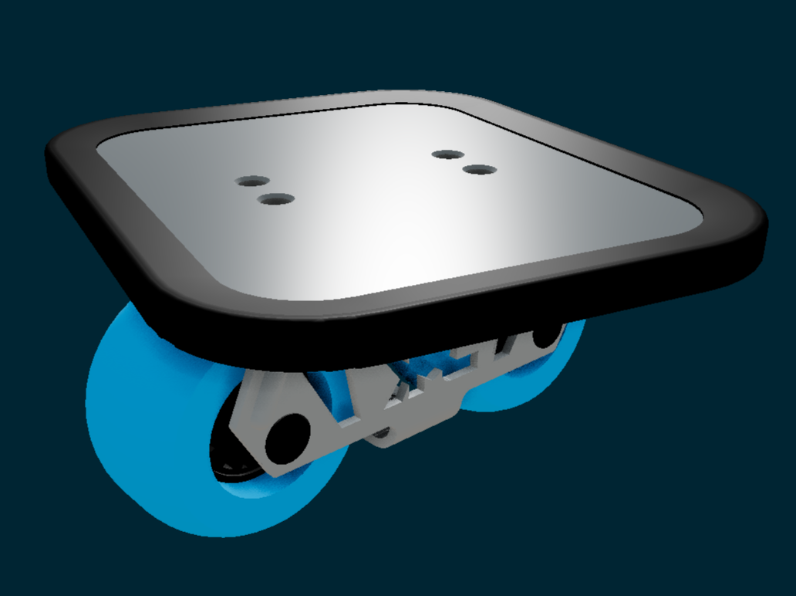

# Freeskate

A [FreeCAD](https://www.freecad.org) model of a [JMK](https://www.jmkride.com) [Freeskate](https://en.wikipedia.org/wiki/Freeskates). The 3D model is viewable at [shone.dev/freeskate](https://shone.dev/freeskate)

## Holster

To get rail length: `App.getDocument("freeskate").getObjectsByLabel("rails-shape-binder")[0].Shape.Length`

Rail segment lengths, from middle to outer:

| Type | Length (cm) | Diameter (cm) | Formula |
|-|-|-|-|
| Bend 90deg  | 5.185 | 6.6 | (Spreadsheet.railtruckclearance+Spreadsheet.raildiameter) * pi * .25 |
| Straight    | 12.72 |     | Spreadsheet.railLengthNegY + 3.12cm                                  |
| Bend 180deg |  3.30 | 2.1 | (Spreadsheet.raildeckclearance+Spreadsheet.raildiameter) * pi * .5   |
| Straight    | 13.90 |     | Spreadsheet.railLengthNegY + Spreadsheet.railLengthPosY              |
| Bend 180deg |  3.30 | 2.1 | (Spreadsheet.railcatchclearance+Spreadsheet.raildiameter) * pi * .5  |
| Straight    | 11.60 |     | Spreadsheet.railLengthPosY + 7.3cm                                   |

## Rod bending

6mm stainless steel rod, bent 180 degrees around an 18mm diameter mandril resulted in an actual inner bend diameter of 19.5mm (outer diameter ~32mm). The actual bend diameter is larger than the mandril due to spring-back of the stainless steel material. Also, to acheive a 180 degree bend the rod must be bend back onto itself so that it touches and then bent even a bit further.

| Material                | Bend       | Mandril diameter | Actual bend diameter (inner) |
| ----------------------- | ---------- | ---------------- | ---------------------------- |
| 6mm Stainless steel rod | 180 degree |             18mm |                       19.5mm |
| 6mm Stainless steel rod | 180 degree |              9mm |                       10.0mm |
